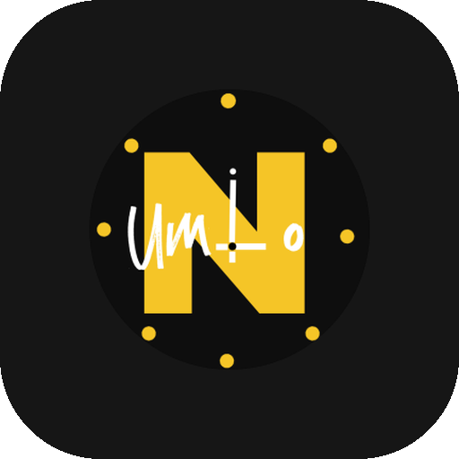

  

<h1 align="center">Clock by Numio</h1>

  A clean, minimal, open-source Android clock app built with Kotlin &amp; Jetpack Compose. 
  No ads. No tracking. No internet permission. Just a clock.

  
  
  
  
  
  
  

🌐 Part of <a href="https://getnumio.org">Numio</a> — small, honest apps made by a Keralite.

---

## ✨ Features

- ✅ Analog + digital clock with three dial styles
- ✅ World clocks — add, remove and reorder cities (correct half-hour zones and daylight saving)
- ✅ Alarms with repeat days, gentle volume fade-in and lock screen support
- ✅ Two alarm styles — **Hold to Unlock** and **Chase the Moon** (hard mode 🌙)
- ✅ Snooze duration — 5 / 10 / 15 / 20 minutes
- ✅ Safer delete — hold an alarm to delete, with confirm and Undo
- ✅ Timer and stopwatch
- ✅ **Home screen widgets**
  - Card and Clear widgets with 6 font styles, resizable
  - **Poster widget** in nine styles: Marker, Bold, Sketch, Sketch Clear, Bubble, Bubble Clear, Sadhya (a Kerala sadhya on a banana leaf) and Bloom (a hand-drawn bouquet)
  - **Type clock** (2×2): big two-colour digits with the date, 3 layouts, 7 fonts, outline option
  - Sketch styles use hand-drawn letters and digits by RR
  - Widgets follow your accent colour
- ✅ Theme customization — preset accent colors + custom hex input
- ✅ First-launch setup that explains every permission
- ✅ Hand-drawn custom app icon
- ✅ A little easter egg 🤫
- ✅ 100% offline — nothing ever leaves your device

## 📲 Download

Get the latest APK from [Releases](https://github.com/rag-creation/numio-clock/releases/latest).

F-Droid version coming soon.

## 📱 Requirements

- Android 8.0 (API 26) or higher

## 🛠️ Built With

- [Kotlin](https://kotlinlang.org/)
- [Jetpack Compose](https://developer.android.com/jetpack/compose)
- [DataStore](https://developer.android.com/jetpack/androidx/releases/datastore)
- [Navigation Compose](https://developer.android.com/jetpack/compose/navigation)

## 🔤 Fonts

The poster and type clock widgets use these fonts, bundled in the app (no internet, no tracking).
Licenses are in the [licenses](licenses/) folder:

- [Permanent Marker](https://fonts.google.com/specimen/Permanent+Marker) by Font Diner (Apache License 2.0)
- [Bangers](https://fonts.google.com/specimen/Bangers) by Vernon Adams (SIL OFL 1.1)
- [Baloo 2](https://fonts.google.com/specimen/Baloo+2) by Ek Type (SIL OFL 1.1), ExtraBold, Latin subset
- [Fraunces](https://fonts.google.com/specimen/Fraunces) by Undercase Type (SIL OFL 1.1), Bold, Latin subset
- [Cormorant Garamond](https://fonts.google.com/specimen/Cormorant+Garamond) by Christian Thalmann (SIL OFL 1.1), Bold, Latin subset
- [DM Serif Display](https://fonts.google.com/specimen/DM+Serif+Display) by Colophon Foundry (SIL OFL 1.1), Latin subset
- [Anton](https://fonts.google.com/specimen/Anton) by Vernon Adams (SIL OFL 1.1), Latin subset
- [Rubik Mono One](https://fonts.google.com/specimen/Rubik+Mono+One) by Hubert and Fischer (SIL OFL 1.1), Latin subset
- [Bungee](https://fonts.google.com/specimen/Bungee) by David Jonathan Ross (SIL OFL 1.1), Latin subset
- [Pirata One](https://fonts.google.com/specimen/Pirata+One) by Rodrigo Fuenzalida and Nicolas Massi (SIL OFL 1.1)
- [Joti One](https://fonts.google.com/specimen/Joti+One) by Eduardo Tunni (SIL OFL 1.1)
- [Moirai One](https://fonts.google.com/specimen/Moirai+One) by Jiyeon Park (SIL OFL 1.1), Latin subset

## 📄 License

GPL-3.0 — see [LICENSE](LICENSE)

## 🤝 Contributing

Issues and pull requests are welcome! If you find a bug or have a feature idea, open an issue.

## 💛 About

The second app in the [Numio](https://getnumio.org) family, after [Numio Calculator](https://github.com/rag-creation/numio). Built because I kept hitting the wrong snooze button — with the help of Claude AI as my coding assistant.

With Lo❤️e, R.R
